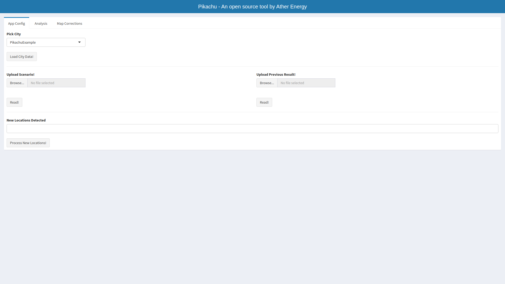
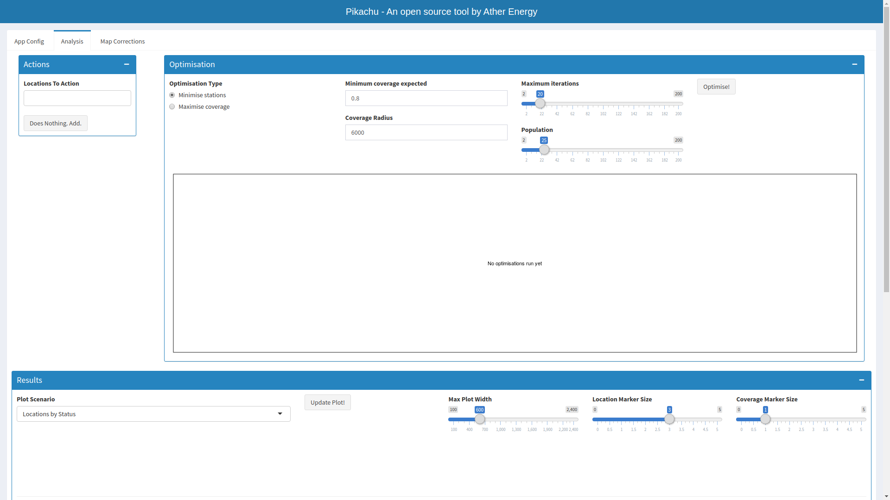
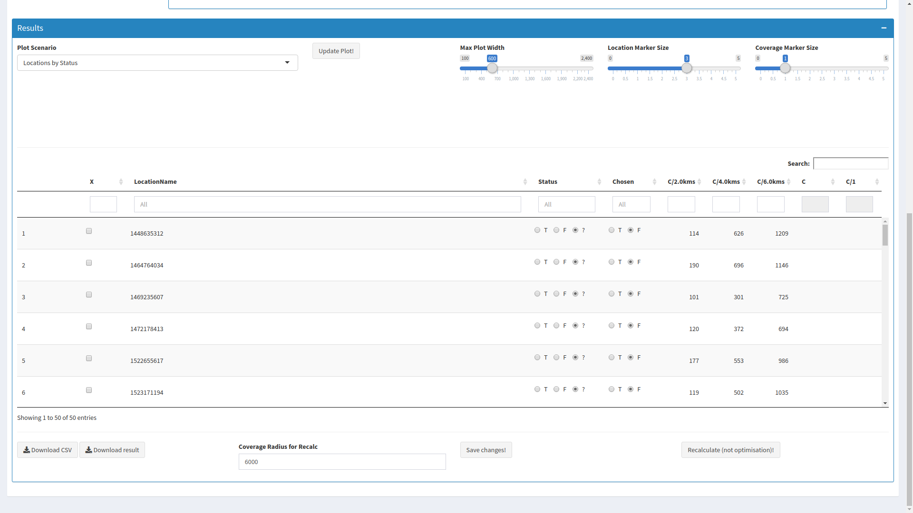
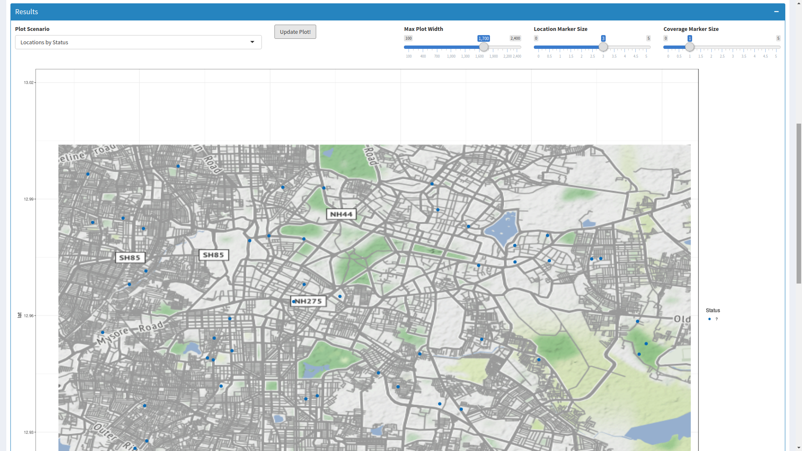
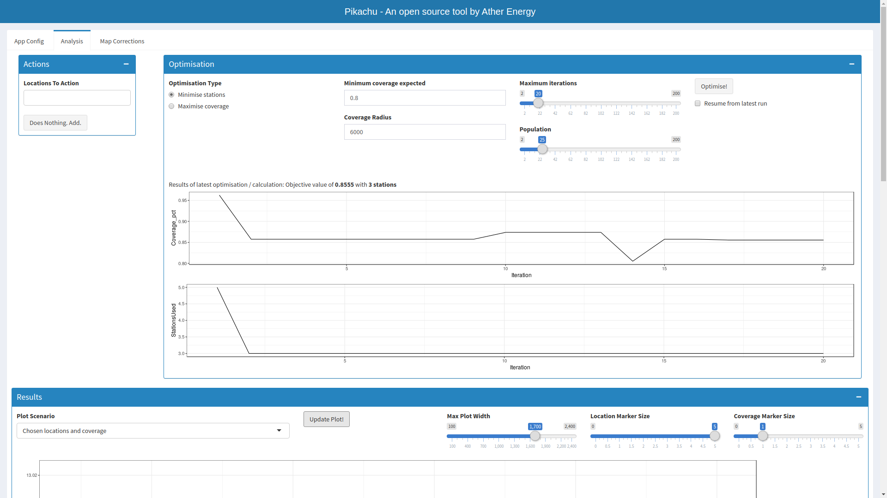
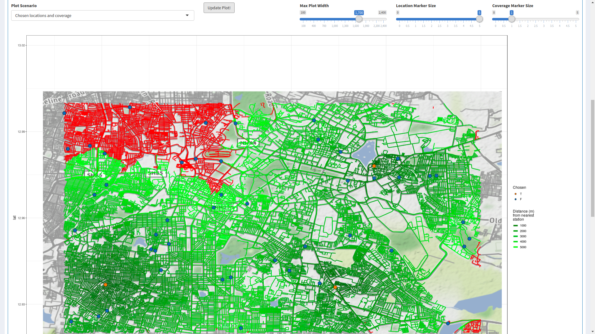

## RAO

### What Does The App Do

The app was built to find the least number and location of charging stations
required in a region such that any person, from anywhere on the road in that 
region, should be within a certain driving distance from at least one charging
station. We'd written <a href = 
"https://blog.atherenergy.com/point-me-to-it-f33266f135b6">a blog post</a> 
about it.

To use the app, you need to supply three inputs:
- the region of interest
- the accessibility target, eg. one should never be more than 5 kms by road 
from a charging station from anywhere in the region
- candidate locations in the region for where we could set up charging stations

Using those inputs the app can run two sorts of optimisations for you:
- If you have a limit on the number of charging stations you can put, what are 
the best locations to put them at so you maximise accessibility
- If you have a coverage target such that a certain percent of the city must 
clear the accessibility target, what are the best locations to put stations in 
such that you meet that target with the minimum number of stations

That's pretty much the core functionality. The app further enables you to 
visualise the results of the optimisation, modify the inputs to the 
optimisation, point out scope for some more improvement, override the 
optimisation results and evaluate the impact of those changes, add new 
candidate locations, etc.

You can follow the instructions below and set it up to solve your problem for
you. You could be optimising for bus stops, police stations, shops, or 
anything else which needs accessibility throughout a region.

### Screenshots From The App

#### Opening Screen

#### Analysis Tab

#### Visualisation

#### Optimisation Output

### Intructions To Use

Instructions on setting up and using [here](./Instructions.md)

### Acknowledgements

This tool is built in R and heavily utilises the libraries - data.table, 
ggplot2, ggmap, GA, igraph, shiny, and datatable, among others. Apart from R,
it heavily uses data from Open Street Maps and map tiles from Stamen. 